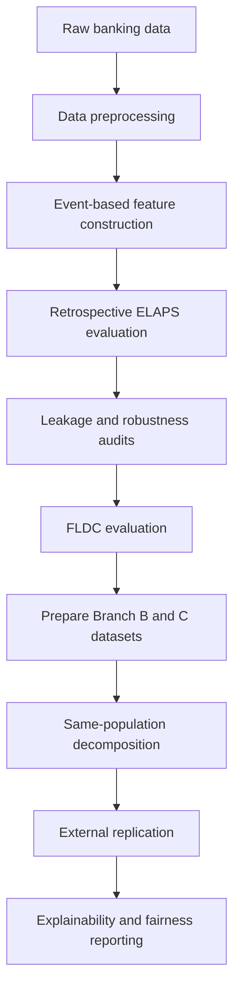

# ELAPS: Event-Based Leakage-Aware Propensity Scoring

Official implementation of **ELAPS**, a leakage-audited machine-learning framework for credit-card cross-sell propensity prediction in retail banking.

> **Paper:** *ELAPS: A Leakage-Audited Machine Learning Framework for Credit-Card Cross-Sell Propensity Prediction in Retail Banking*

---

## Overview

ELAPS is designed to develop and evaluate credit-card propensity models under deployment-oriented conditions. It reduces the risk of temporal leakage through event-based feature construction and audits whether retrospective performance remains valid when the cohort, observation window, target, and model-selection procedure are aligned with prospective use.

The repository contains the complete experimental workflow used in the study, including retrospective modelling, leakage diagnostics, Forward-Looking Deployment Cohort (FLDC) evaluation, calibration, uncertainty analysis, explainability, subgroup fairness assessment, and external replication on the Santander dataset.

ELAPS is an **evaluation methodology**, not a new prediction algorithm. XGBoost and LightGBM are used as established learners; the methodological contribution lies in event-anchored cohort construction, same-population decomposition, and deployment-aligned auditing.

### Key features

- Event-based, point-in-time feature construction
- Leakage-aware preprocessing and date validation
- Label-shuffle/permutation sanity checks
- Placebo-cutoff diagnostics
- Forward-Looking Deployment Cohorts at 30, 60, 90, and 180 days
- Dedicated preparation of the Branch B and Branch C datasets
- Same-population A-B-C decomposition
- Comparison of XGBoost without resampling and XGBoost with random oversampling
- Relationship-start cohort robustness check (E6a)
- Calibration and Brier Skill Score analysis
- Bootstrap confidence intervals
- Feature ablation and SHAP explainability
- Fairness evaluation by sex and age group
- External replication using Santander data

---

## Workflow



---

## Repository structure

```text
ELAPS/
├── README.md
├── requirements.txt
├── Notebooks/
│   ├── 01_VIB_Dataprocessing.ipynb
│   ├── 02_VIB_ELAPS.ipynb
│   ├── 03_VIB_Placebo.ipynb
│   ├── 04_VIB_FLDC_30D.ipynb
│   ├── 05_VIB_FLDC_60D.ipynb
│   ├── 06_VIB_FLDC_90D.ipynb
│   ├── 07_VIB_FLDC_180D.ipynb
│   ├── 08_VIB_LightGBM_ROS.ipynb
│   ├── 09_Santander_ELAPS.ipynb
│   ├── 10_Santander_Placebo.ipynb
│   ├── 11_Santander_FLDC_60D.ipynb
│   ├── 12_Santander_FLDC_90D.ipynb
│   ├── 13_VIB60ABC.ipynb
│   ├── 14_VIB_FLDC_60D_B.ipynb
│   └── 15_VIB_FLDC_60D_C.ipynb
└── data/
```

The repository currently contains 15 notebooks under `Notebooks/`. The `data/` directory is not populated in the public repository because the VIB data are confidential and the Santander data remain subject to their original distribution terms.

---

## Notebook guide

| Notebook | Purpose |
|---|---|
| `01_VIB_Dataprocessing.ipynb` | Cleans and links the VIB source tables, validates dates, and prepares the core event-anchored and landmark inputs used by downstream notebooks. |
| `02_VIB_ELAPS.ipynb` | Runs the main retrospective ELAPS experiment and the embedded permutation, calibration, Brier Skill Score, fairness, ablation, SHAP, and bootstrap analyses. |
| `03_VIB_Placebo.ipynb` | Applies the VIB placebo-cutoff diagnostic to test sensitivity to observation-window construction. |
| `04_VIB_FLDC_30D.ipynb` | Builds and evaluates the 30-day VIB FLDC sensitivity configuration. |
| `05_VIB_FLDC_60D.ipynb` | Runs the primary deployment-aligned 60-day VIB FLDC experiment. |
| `06_VIB_FLDC_90D.ipynb` | Builds and evaluates the 90-day VIB FLDC sensitivity configuration. |
| `07_VIB_FLDC_180D.ipynb` | Builds and evaluates the 180-day VIB FLDC sensitivity configuration. |
| `08_VIB_LightGBM_ROS.ipynb` | Tests learner and sampling robustness using LightGBM with random oversampling. |
| `09_Santander_ELAPS.ipynb` | Establishes the retrospective ELAPS reference on the Santander dataset. |
| `10_Santander_Placebo.ipynb` | Repeats the placebo-cutoff diagnostic on Santander data. |
| `11_Santander_FLDC_60D.ipynb` | Runs the 60-day Santander FLDC-style external replication. |
| `12_Santander_FLDC_90D.ipynb` | Runs the 90-day Santander FLDC-style sensitivity analysis. |
| `13_VIB60ABC.ipynb` | Loads the prepared Branch A, B, and C datasets and runs the A-B-C decomposition, XGBoost None-versus-ROS comparison, and relationship-start cohort split (E6a). |
| `14_VIB_FLDC_60D_B.ipynb` | Constructs and validates the Branch B dataset required by the 60-day A-B-C decomposition. |
| `15_VIB_FLDC_60D_C.ipynb` | Constructs and validates the Branch C dataset required by the 60-day A-B-C decomposition. |

### Analyses contained in `02_VIB_ELAPS.ipynb`

In addition to the main retrospective model, this notebook contains:

1. **Label-shuffle/permutation test** — estimates a null performance distribution after permuting the target labels.
2. **Calibration and Brier Skill Score** — evaluates probability accuracy independently of ranking performance.
3. **Fairness analysis** — compares subgroup performance by sex and age group.
4. **Feature ablation** — measures performance changes after removing selected features or feature groups.
5. **SHAP analysis** — explains global and customer-level model behaviour.
6. **Bootstrap confidence intervals** — quantifies uncertainty for discrimination and campaign-ranking metrics.

### Analyses contained in `13_VIB60ABC.ipynb`

This notebook is the downstream analysis notebook for the 60-day A-B-C experiment. Before running it, prepare the required inputs as follows:

- Branch A is obtained from the primary 60-day FLDC workflow in `05_VIB_FLDC_60D.ipynb`.
- Branch B is constructed in `14_VIB_FLDC_60D_B.ipynb`.
- Branch C is constructed in `15_VIB_FLDC_60D_C.ipynb`.

Notebooks 14 and 15 perform data construction and validation; they do not replace the comparative modelling and decomposition performed in notebook 13. After all three branch datasets are available, notebook 13 runs the following analyses:

1. **Same-population A-B-C decomposition**
   - Configuration A: fixed 60-day predictors on the FLDC-eligible population.
   - Configuration B: event-anchored predictors on the same FLDC-eligible population.
   - Configuration C: retrospective event-anchored reference on the full VIB population.
   - The A-B comparison estimates the observation-window component, `D_window`.

2. **Sampling-choice comparison within FLDC**
   - XGBoost without resampling is compared with XGBoost plus random oversampling.
   - Selection is based on cross-validation AUC within the training data.
   - The final holdout set is not used for model selection.

3. **Relationship-start cohort split (E6a)**
   - Customers are ordered using `CLIENT_CREATE_DATE`.
   - The earliest 80% form the training cohort and the latest 20% form the test cohort.
   - E6a is reported as a separate robustness check and is not treated as part of the A-B-C decomposition.

---

## Installation

### 1. Clone the repository

```bash
git clone https://github.com/trang1981/ELAPS.git
cd ELAPS
```

### 2. Create an optional virtual environment

```bash
python -m venv .venv
```

Activate the environment:

```bash
# Linux or macOS
source .venv/bin/activate

# Windows PowerShell
.venv\Scripts\Activate.ps1
```

### 3. Install dependencies

```bash
python -m pip install --upgrade pip
pip install -r requirements.txt
```

### 4. Launch Jupyter Notebook

```bash
jupyter notebook
```

The notebooks can also be executed in Google Colab. When using Colab, mount Google Drive and update the input and output paths in the configuration cell of each notebook.

---

## Quick start

Before execution, update the dataset paths and output directory in each notebook. Keep the random seeds provided in the code unchanged when reproducing the reported experiments.

### Internal VIB workflow

Run the notebooks in the following order:

1. `01_VIB_Dataprocessing.ipynb`
2. `02_VIB_ELAPS.ipynb`
3. `03_VIB_Placebo.ipynb`
4. `05_VIB_FLDC_60D.ipynb`
5. `04_VIB_FLDC_30D.ipynb`
6. `06_VIB_FLDC_90D.ipynb`
7. `07_VIB_FLDC_180D.ipynb`
8. `08_VIB_LightGBM_ROS.ipynb`
9. `14_VIB_FLDC_60D_B.ipynb`
10. `15_VIB_FLDC_60D_C.ipynb`
11. `13_VIB60ABC.ipynb`

Notebook 05 provides the primary FLDC result. Notebooks 04, 06, and 07 are observation-window sensitivity analyses and may be run in any order after preprocessing. For the A-B-C analysis, run notebooks 14 and 15 after the core ELAPS and 60-day FLDC datasets have been prepared, and then run notebook 13 last.

### External Santander workflow

1. `09_Santander_ELAPS.ipynb`
2. `10_Santander_Placebo.ipynb`
3. `11_Santander_FLDC_60D.ipynb`
4. `12_Santander_FLDC_90D.ipynb`

The Santander workflow is independent of the confidential VIB dataset.

---

## Datasets

### VIB dataset

The internal VIB dataset contains confidential retail-banking customer information and **cannot be publicly released**. It is therefore not included in this repository.

The VIB workflow requires customer identifiers, relationship-start dates, first credit-card adoption dates, and the customer, account, loan, deposit, digital-activity, and transaction variables needed to construct the study predictors. Customer identifiers are used only for linkage and auditing and must not be included in the model feature matrix.

### Santander dataset

External replication uses the **Santander Product Recommendation** dataset. Users must obtain the dataset from its official source under the applicable terms and update the data paths before running notebooks 09-12. Santander data are not redistributed in this repository.

Users without authorized VIB access can still examine and reproduce the external-validation workflow using the Santander notebooks.

---

## Evaluation outputs

The notebooks report complementary metrics for discrimination, classification, probability quality, and campaign capacity:

- AUC and Kolmogorov-Smirnov statistic
- Recall, precision, F1 score, and accuracy
- Brier score and Brier Skill Score
- Precision@K, Lift@K, and Capture@K
- Bootstrap confidence intervals
- Calibration curves and ROC curves
- Fairness and subgroup-performance tables
- SHAP and feature-ablation results

Ranking metrics and probability calibration are evaluated separately because a model can rank customers well while producing poorly calibrated probabilities.

---

## Reproducibility protocol

To reproduce the reported results:

1. Install the dependencies listed in `requirements.txt`.
2. Obtain authorized access to the required input data.
3. Update the data and output paths in each notebook.
4. Execute every required notebook from top to bottom.
5. Use the random seeds, split definitions, and landmark lengths specified in the notebooks.
6. Apply resampling only to training data or within training folds.
7. Keep the final holdout set isolated from model and sampling-strategy selection.
8. Construct every feature using information available no later than its permitted cutoff.

Small numerical differences may occur across software versions and hardware. The environment information printed by each notebook should be retained with the final outputs.

---

## Interpretation notes

- A strong retrospective AUC does not by itself demonstrate deployment value.
- The retrospective-to-FLDC difference is a composite deployment gap and should not be described as a pure leakage effect.
- `D_window` is estimated through a same-population comparison designed to isolate observation-window geometry more directly.
- SHAP values explain model behaviour but do not establish causal effects.
- Fairness results are subgroup diagnostics and may be unstable for small groups.

---

## Data availability

The proprietary VIB data cannot be shared publicly. This repository provides:

- source code and experimental notebooks;
- the data-preprocessing and event-anchoring workflow;
- leakage and robustness audits;
- FLDC implementations;
- same-population decomposition;
- external Santander replication; and
- model evaluation, explanation, and fairness procedures.

No synthetic VIB dataset is included in the current release. Any future synthetic example must preserve confidentiality and will be clearly identified as simulated data rather than a substitute for the original study cohort.

---

## Citation

If you use this repository, please cite the accompanying paper and the software repository. Until the final journal record is available, the repository can be cited as:

```bibtex
@software{trang2026elaps,
  author  = {Tran Thu Trang},
  title   = {ELAPS: Event-Based Leakage-Aware Propensity Scoring},
  year    = {2026},
  url     = {https://github.com/trang1981/ELAPS},
  note    = {Code accompanying a manuscript submitted for publication}
}
```

Replace this entry with the complete paper citation, including the final author list, journal, volume, pages, and DOI, after publication.

---

## License

This repository is provided for academic and non-commercial research purposes. No permission is granted to redistribute the proprietary VIB data. For uses outside this scope, contact the corresponding author.

---

## Contact

**Tran Thu Trang**  
Faculty of Information Technology  
Dai Nam University, Hanoi, Vietnam  
Email: [trangtt@dainam.edu.vn](mailto:trangtt@dainam.edu.vn)

For technical questions or reproducibility issues, please open an issue at [github.com/trang1981/ELAPS/issues](https://github.com/trang1981/ELAPS/issues).

